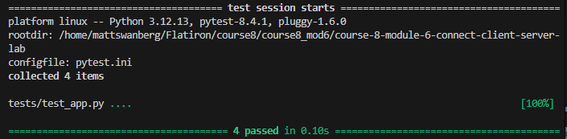
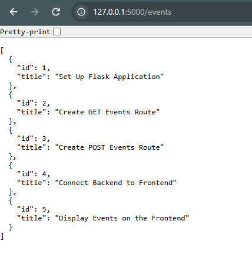
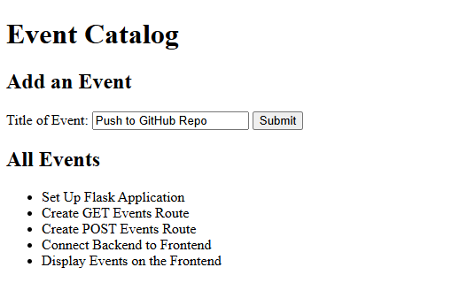

# Lab: Building a Front-to-Back Event Catalog

This project is a full-stack Event Catalog application that connects a static HTML and JavaScript frontend to a Flask backend.

Users can view existing events and add new events through the frontend. The Flask API handles retrieving event data, validating new events, automatically assigning unique IDs, and storing new events during the current application session.

---

## Learning Goals

- Serve a homepage using Flask
- Create API routes that return and accept JSON
- Handle GET and POST requests on the backend
- Connect a Flask backend to a static frontend
- Use JavaScript `fetch()` to communicate with a Flask API
- Dynamically display API data in the browser
- Handle form submissions with JavaScript
- Validate incoming POST request data
- Return appropriate HTTP status codes
- Pass all provided backend tests

---

## Features

### Flask Backend

The Flask backend provides the following functionality:

- Returns a JSON welcome message
- Returns all available events
- Accepts new events through POST requests
- Validates that new events contain a title
- Automatically generates a unique ID for each new event
- Returns appropriate HTTP status codes
- Uses CORS to allow communication between the frontend and backend

### Frontend

The frontend uses HTML and JavaScript to:

- Display an Event Catalog
- Retrieve events from the Flask backend
- Dynamically display events under the **All Events** list
- Allow users to submit new events
- Send new events to the backend using a POST request
- Refresh the event list after a new event is created

---

## API Routes

### GET `/`

Returns a JSON welcome message.

Example response:

```json
{
    "status": "success",
    "message": "Welcome to my lab"
}
```

**Status Code:** `200 OK`

---

### GET `/events`

Returns the complete list of events.

Example response:

```json
[
    {
        "id": 1,
        "title": "Set Up Flask Application"
    },
    {
        "id": 2,
        "title": "Create GET Events Route"
    },
    {
        "id": 3,
        "title": "Create POST Events Route"
    }
]
```

**Status Code:** `200 OK`

---

### POST `/events`

Creates a new event.

The request must contain a `title`.

Example request:

```json
{
    "title": "Connect Backend to Frontend"
}
```

The backend automatically generates a unique ID for the event.

Example response:

```json
{
    "id": 4,
    "title": "Connect Backend to Frontend"
}
```

**Status Code:** `201 Created`

If the required `title` is missing, the server returns:

```json
{
    "error": "Title not found"
}
```

**Status Code:** `400 Bad Request`

---

## Project Structure

```text
.
├── client/
│   ├── index.html
│   ├── styles.css
│   └── script.js
├── data.py
├── server.py
├── tests/
│   └── test_app.py
├── Pipfile
├── Pipfile.lock
└── README.md
```

---

## Setup Instructions

### 1. Clone the Repository

```bash
git clone <repo-url>
cd course-8-module-6-connect-client-server-lab
```

### 2. Create the Environment

Install the project dependencies using Pipenv:

```bash
pipenv install
```

Enter the virtual environment:

```bash
pipenv shell
```

---

## Running the Application

Start the Flask backend:

```bash
python server.py
```

The Flask development server will run at:

```text
http://127.0.0.1:5000
```

Keep the Flask server running while using the frontend.

---

## Opening the Frontend

Open:

```text
client/index.html
```

in a web browser.

The frontend communicates with the Flask server through JavaScript using the Fetch API.

When the page loads, the frontend sends a GET request to:

```text
http://127.0.0.1:5000/events
```

The returned events are dynamically added to the **All Events** list.

---

## Adding an Event

Enter an event title into the **Add an Event** form and click **Submit**.

JavaScript intercepts the form submission and sends a POST request to:

```text
http://127.0.0.1:5000/events
```

The Flask backend:

1. Receives the JSON request.
2. Validates that a title was provided.
3. Generates a unique event ID.
4. Adds the event to the event list.
5. Returns the newly created event with a `201` status code.

The frontend then retrieves the updated event list and displays the new event under **All Events**.

---

## Running the Tests

Run the provided backend tests with:

```bash
pytest
```

To stop after the first test failure while debugging:

```bash
pytest -x
```

All provided tests should pass before completing the lab.

---

## Technologies Used

- Python
- Flask
- Flask-CORS
- HTML
- JavaScript
- Fetch API
- JSON
- Pytest
- Pipenv

---

## Key Concepts Practiced

This project demonstrates how the frontend and backend of a web application communicate.

The Flask backend exposes API endpoints that work with JSON data, while JavaScript uses `fetch()` to make HTTP requests to those endpoints.

The application demonstrates the following request flow:

```text
Frontend
   ↓
JavaScript fetch()
   ↓
Flask API
   ↓
Event Data
   ↓
JSON Response
   ↓
JavaScript
   ↓
Updated HTML
```

This allows events created through the frontend to be processed by the Flask backend and then displayed dynamically in the browser.

---

## Screenshots

### Testing Suite Success



### Backend API list



### Frontend render of list and Add New


---

## Completion Checklist

- [x] Implemented the `/` route
- [x] Implemented `GET /events`
- [x] Implemented `POST /events`
- [x] Added POST request validation
- [x] Added automatic event ID generation
- [x] Connected the frontend to the Flask backend
- [x] Displayed backend event data on the frontend
- [x] Added frontend event submission
- [x] Used appropriate HTTP status codes
- [x] Added code documentation
- [x] Passed the provided backend tests

## Author

Created by Matthew Swanberg as part of Course 8 Module 6 (Lab Client-Server Application - Event Catalog)